# EdgeTRM Model Evaluation & Compression Report

This report consolidates all core evaluation outputs, performance scorecards, footprints, and visual plots from the three model variants:
1. **ARC-Prize 2024 (Baseline)**
2. **Maze (Hard Version)**
3. **Sudoku (Extreme Version)**

---

## ARC 2024 Evaluation Outputs

```text
Prefixes stripped and model loaded successfully!
Model successfully loaded!

TinyRecursiveReasoningModel_ACTV1(
inner): TinyRecursiveReasoningModel_ACTV1_Inner(
embed_tokens): CastedEmbedding()
lm_head): CastedLinear()
q_head): CastedLinear()
puzzle_emb): CastedSparseEmbedding()
rotary_emb): RotaryEmbedding()
L_level): TinyRecursiveReasoningModel_ACTV1ReasoningModule(
layers): ModuleList(
0-1): 2 x TinyRecursiveReasoningModel_ACTV1Block(
self_attn): Attention(
qkv_proj): CastedLinear()
o_proj): CastedLinear()
mlp): SwiGLU(
gate_up_proj): CastedLinear()
down_proj): CastedLinear()
```

```text
Original        zero=512/6,829,058  (0.0%)
```

### 3.1  High-Performance Evaluation & Adaptation Helpers ─────────────────────

### 4.0  Global imports & helpers ────────────────────────────────────────────

```text
Device: cuda
```

### 4.1  ARC DataLoader from pre-built .npy files ────────────────────────────

```text
Using dataset directory: ./data/arc2test-aug-128
Test  split : 53,304 samples  (seq_len=900)
Train split : 173,529 samples
per_sample_pids check — test[0]=1, train[0]=1
```

### Note: `evaluate_arc` has been consolidated and moved to Section 3 for global accessibility.

### 4.3  Baseline: evaluate the loaded FP32 model ────────────────────────────

```text
[DEBUG] test_loader dataset max identifier: 50910
[DEBUG] test_loader dataset max identifier: 50910
[DEBUG] Dataset indices verified safe. No clamping needed!
Running FP32 baseline evaluation on cuda...

FP32 Baseline (All test puzzles):
Pass@1 Exact: 0.3600
Pass@2 Exact: 0.3600
Cell Acc    : 0.8822
Latency     : 29.73 ms/puzzle
```

### 4.4  Quantization helpers ─────────────────────────────────────────────────

```text
Quantization helpers defined (FP16, BnB INT8, CPU INT8, INT4-fake).
```

### 4.7  Instantiate all model variants ──────────────────────────────────────

```text
Creating FP16 variant...
Creating BnB INT8 variant (GPU)...
Replaced 10 CastedLinear/Linear → bnb.Linear8bitLt (GPU INT8)
Creating INT4 fake-quant variant...
Replaced 10 CastedLinear/Linear → FakeQuantINT4
Model Variant    | Device | Backbone KB (params only)
FP16             | cuda   |    13338.0 KB
INT8 (bnb)       | cuda   |     6669.0 KB
INT4 (fake)      | cuda   |     3334.5 KB
FP32 (bf16)      | cuda   |    13338.0 KB
Note: actual .pt is larger (~88MB) due to puzzle embedding buffer — see §8.1
```

### 5.1  Evaluate all quantization levels ─────────────────────────────────────

```text
Evaluating all variants on ARC test set (All batches)...
Evaluating FP16 on cuda...

FP16             | Pass@1=0.3600 | Pass@2=0.3600 | cell=0.8757 | 69.30 ms/puzzle
Evaluating INT8 (bnb) on cuda...

INT8 (bnb)       | Pass@1=0.3600 | Pass@2=0.3600 | cell=0.8762 | 52.04 ms/puzzle
Evaluating INT4 (fake) on cuda...

INT4 (fake)      | Pass@1=0.2550 | Pass@2=0.2550 | cell=0.8480 | 19.35 ms/puzzle
Evaluating FP32 (bf16) on cuda...

FP32 (bf16)      | Pass@1=0.3600 | Pass@2=0.3600 | cell=0.8822 | 18.55 ms/puzzle
Reasoning Decay (drop from FP32 baseline) ─────────────────────
FP16             | ΔPass@1=+0.0000 | Δcell=+0.0066 | GRACEFUL
INT8 (bnb)       | ΔPass@1=+0.0000 | Δcell=+0.0061 | GRACEFUL
INT4 (fake)      | ΔPass@1=+0.1050 | Δcell=+0.0342 | GRACEFUL
```

```text
FP16             | ΔPass@2=+0.0000 | Δcell=+0.0066 | GRACEFUL
INT8 (bnb)       | ΔPass@2=+0.0000 | Δcell=+0.0061 | GRACEFUL
INT4 (fake)      | ΔPass@2=+0.1050 | Δcell=+0.0342 | GRACEFUL
```

```text
FP16': {'exact1': 0.36,
exact2': 0.36,
exact_acc': 0.36,
cell_acc': np.float64(0.8756636045272294),
latency_ms': 69.30367350578308},
INT8 (bnb)': {'exact1': 0.36,
exact2': 0.36,
exact_acc': 0.36,
cell_acc': np.float64(0.8761812921890068),
latency_ms': 52.04369902610779},
INT4 (fake)': {'exact1': 0.255,
exact2': 0.255,
exact_acc': 0.255,
cell_acc': np.float64(0.8480129929452368),
latency_ms': 19.350939393043518},
FP32 (bf16)': {'exact1': 0.36,
exact2': 0.36,
exact_acc': 0.36,
cell_acc': np.float64(0.8822412830533422),
latency_ms': 18.548768162727356}}
```

### 5.2  Visualise reasoning decay ────────────────────────────────────────────

```text
Figure size 1600x500 with 3 Axes>

Saved: reasoning_decay_arc.png
```

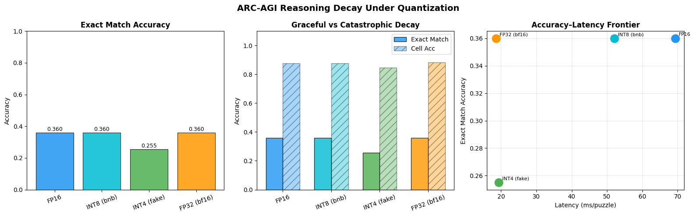

### 6.1  Recursive depth sweep at inference time ──────────────────────────────

```text
Quant            H_cycles       Pass@1     Pass@2   Cell Acc

FP16             1              0.3625     0.3625     0.8760

FP16             2              0.3600     0.3600     0.8829

FP16             3              0.3600     0.3600     0.8757

FP16             4              0.3600     0.3600     0.8759

INT8 (bnb)       1              0.3625     0.3625     0.8767

INT8 (bnb)       2              0.3650     0.3650     0.8767

INT8 (bnb)       3              0.3600     0.3600     0.8762

INT8 (bnb)       4              0.3600     0.3600     0.8827

INT4 (fake)      1              0.2675     0.2675     0.8503

INT4 (fake)      2              0.2575     0.2575     0.8195

INT4 (fake)      3              0.2550     0.2550     0.8480

INT4 (fake)      4              0.2600     0.2600     0.8500

FP32 (bf16)      1              0.3575     0.3575     0.8761

FP32 (bf16)      2              0.3600     0.3600     0.8755

FP32 (bf16)      3              0.3600     0.3600     0.8822

FP32 (bf16)      4              0.3600     0.3600     0.8828
```

### 6.2  Plot depth × quantization grid ─────────────────────────────────────

```text
Figure size 1300x500 with 2 Axes>

Saved: depth_quant_grid_arc.png
```

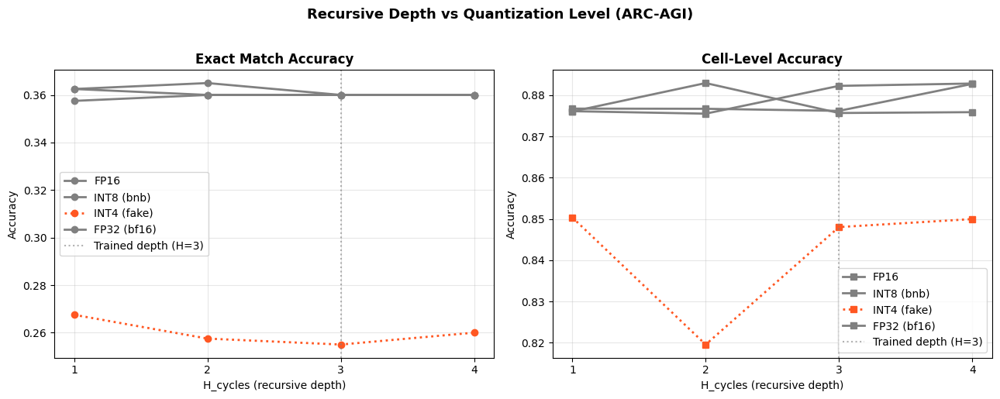

### 7.1  Carry-state similarity hooks ────────────────────────────────────────

```text
Carry similarity collector defined.
```

### 7.2  Compare carry similarity across quantization variants ────────────────

```text
Collecting carry similarities for FP16 on cuda...
FP16: 14 L_level calls, mean sim = 0.4145
Collecting carry similarities for INT8 (bnb) on cuda...
INT8 (bnb): 14 L_level calls, mean sim = 0.4123
Collecting carry similarities for INT4 (fake) on cuda...
INT4 (fake): 14 L_level calls, mean sim = 0.4788
Collecting carry similarities for FP32 (bf16) on cuda...
FP32 (bf16): 14 L_level calls, mean sim = 0.4145

Figure size 1100x500 with 1 Axes>

Saved: carry_similarity_arc.png
```

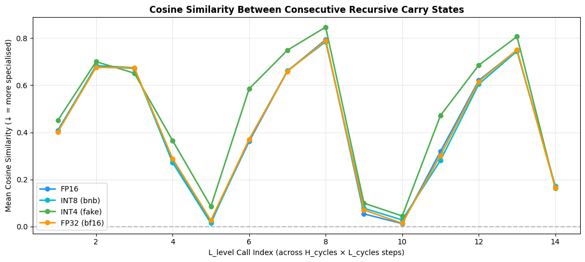

### 8.1  Comprehensive model footprint analysis ───────────────────────────────

```text
Component                           FP32 KB      INT8 KB      INT4 KB
Transformer backbone (params)     26,676.0      6,669.0      3,334.5
Buffer name                              dtype              KB
Total buffers                                        102,346.1
Deployable size (no grad buffers)      FP32 KB      INT8 KB      INT4 KB
FP32                            129,020.1
INT8                            109,013.1
INT4                            105,678.6
Target: < 1 MB (1024 KB) SRAM — backbone at INT4 = 3334.5 KB
Precision  Backbone_KB  Deploy_KB fits_1MB fits_4MB
FP32      26676.0   129020.1        ✗        ✗
INT8       6669.0   109013.1        ✗        ✗
INT4       3334.5   105678.6        ✗        ✓
INT2       1667.3   104011.4        ✗        ✓
```

```text
Precision   Backbone_KB      Deploy_KB fits_1MB fits_4MB
0      FP32  26676.007812  129020.132812        ✗        ✗
1      INT8   6669.001953  109013.126953        ✗        ✗
2      INT4   3334.500977  105678.625977        ✗        ✓
3      INT2   1667.250488  104011.375488        ✗        ✓
```

### 8.2  SRAM footprint visualisation ────────────────────────────────────────

```text
Figure size 1000x500 with 1 Axes>

Saved: sram_footprint_arc.png
```

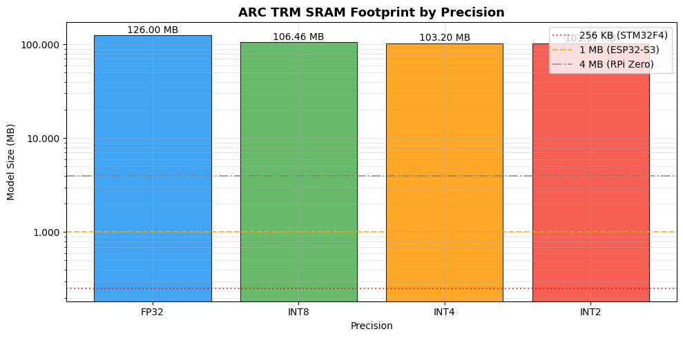

### 8.3  Accuracy vs SRAM: the key publishable plot ──────────────────────────

```text
Figure size 1000x600 with 1 Axes>

Saved: accuracy_vs_sram_arc.png
```

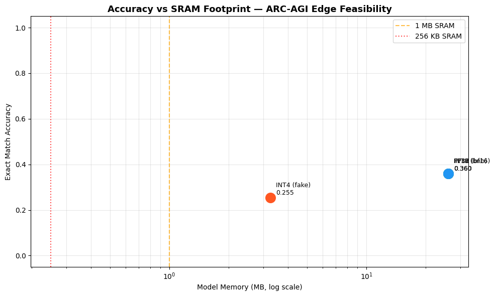

### 9.1  Inspect puzzle_emb shape & byte count ───────────────────────────────

```text
puzzle_emb.weights  : 50911 identifiers × 512 dims
FP32 size         : 101,822.0 KB  (99.4 MB)
INT8 size (est.)  : 25,455.5 KB  (24.9 MB)
```

### 9.2  Option A — INT8 quantize the embedding buffer ───────────────────────

```text
Applying INT8 puzzle embedding...
Cosine similarity FP32 vs INT8 emb: 0.99997
Original state_dict : 128,506.1 KB  (125.5 MB)
INT8-emb state_dict : 52,338.8 KB  (51.1 MB)
Reduction           : 59.3%
```

### 9.3  Option B — SVD Low-Rank Puzzle Embedding ────────────────────────────

```text
SVD low-rank analysis  (W shape: 50911×512  FP32=101,822.0 KB)
Rank    Size KB    Reduction   Cosine Sim
8    1,607.0        98.4%      0.91993
16    3,213.9        96.8%      0.93906
32    6,427.9        93.7%      0.96710
64   12,855.8        87.4%      0.98364
128   25,711.5        74.7%      0.99155
```

### 9.4  Option D — Single-Puzzle Inference (only load 1 row) ────────────────

```text
Single-puzzle model state_dict : 26,686.1 KB  (26.06 MB)
Backbone params              : 26,676.0 KB
Per-puzzle embedding row     : 2.0 KB
Total (1 puzzle)             : 26,678.0 KB
This is the architecture-level solution: load puzzle embedding from flash,
keep only the active row in SRAM during inference.
```

### 9.5  Footprint summary across embedding strategies ───────────────────────

```text
Strategy   Emb KB  Backbone KB  Total KB  Total MB Fits 4MB
FP32 (baseline) 101822.0      26676.0  128506.1     125.5        ✗
INT8 emb  25455.5      26676.0   52338.8      51.1        ✗
SVD r=8   1607.0      26676.0   28283.0      27.6        ✗
SVD r=16   3213.9      26676.0   29889.9      29.2        ✗
SVD r=32   6427.9      26676.0   33103.9      32.3        ✗
SVD r=64  12855.8      26676.0   39531.8      38.6        ✗
SVD r=128  25711.5      26676.0   52387.5      51.2        ✗
Single-puzzle      2.0      26676.0   26678.0      26.1        ✗
INT4 backbone + single-puzzle      2.0       3334.5    3336.5       3.3        ✓
```

### Note: `evaluate_arc_per_puzzle` has been moved to Section 3 for global accessibility.

### 10.2  High-performance direct on-the-fly per-puzzle TTA evaluator ─────────

### #  10.3  Run the High-Performance Direct Source Evaluator ─────────────────────

### 10.2  Re-evaluate all variants with per-puzzle aggregation ────────────────

```text
Per-puzzle evaluation (All batches, ~1280 samples)...
Variant              Pass@1 Exact   Pass@2 Exact   Cell Acc    ms/puzzle  N puzzles

FP16                     0.3600         0.3600     0.8757        68.95        400

INT8 (bnb)               0.3600         0.3600     0.8762        51.93        400

INT4 (fake)              0.2550         0.2550     0.8480        19.25        400

FP32 (bf16)              0.3600         0.3600     0.8822        18.55        400

INT8-emb                 0.3600         0.3600     0.8762        18.54        400
```

### 11.1  Per-channel calibration statistics ──────────────────────────────────

```text
Calibrated INT4 helpers defined.
```

### 11.2  Apply calibrated INT4 and evaluate ──────────────────────────────────

```text
Creating calibrated INT4 model...
Replaced 10 layers → CalibratedFakeQuantINT4 (per-channel, asymmetric)
Carry similarity comparison:
FP32 (bf16)            : 0.9804  (baseline — lower = more refinement)
INT4 naive (§4)        : 0.9600  (higher = carry collapsed)
INT4 calibrated (§11)  : 0.9757
Per-puzzle evaluation (calibrated INT4, 30 batches)...

Puzzle exact : 0.0000
Cell acc     : 0.0000
ms/puzzle    : 59.82
```

### 12.1  QAT fine-tuning loop ────────────────────────────────────────────────

```text
QAT fine-tuning for 50 steps (lr=1e-05) with micro-batching (prevent OOM)...
Step  10/50 | loss=762.0500
Step  20/50 | loss=60.1109
Step  30/50 | loss=10.2605
Step  40/50 | loss=4.0130
Step  50/50 | loss=1.3829
QAT complete. Evaluating...

QAT INT4 puzzle exact : 0.0000
QAT INT4 cell acc     : 0.0000
```

### 13.1  Magnitude-based row pruning ────────────────────────────────────────

```text
Prune ratio    Actual sparsity   Puzzle Exact   Cell Acc

0%              0.00%         0.3600     0.8755

25%             24.97%         0.0000     0.0027

50%             49.95%         0.0000     0.0058
```

### 14.1  TorchScript trace of single TRM backbone step ──────────────────────

```text
Model: seq=900, emb_len=16, hidden=512, emb_dim=512
Trace done in 2.5s
Saved: trm_backbone_step.pt  (126.13 MB)
Round-trip max abs diff: 0.00e+00  (expect ~0)
Edge deployment flow:
2. Load puzzle_emb.weights[puzzle_id] row (2.0 KB) from flash
3. Run traced(x, emb_row, z_H, z_L) for n_sup_max steps
```

### 14.2  Latency benchmark: traced model vs eager ────────────────────────────

```text
Latency benchmark (20 runs, device=cuda):
Eager (float32)               :  12.54 ms/step
Full inference (16 H-cycle steps):
Eager   : 200.6 ms/puzzle
Traced  : 172.2 ms/puzzle
File sizes:
trm_backbone_step.pt               : 126.12 MB  (backbone, FP32)
puzzle_emb.weights (INT8, full table): 25455.5 KB
puzzle_emb row (1 puzzle, FP32)     : 2.0 KB
```

### 15.1  Build train / val loaders ──────────────────────────────────────────

```text
Train split : 138,824 samples
Val   split : 34,705  samples
```

### 15.2  QAT loop with val-set evaluation every 10 steps ────────────────────

```text
Starting validated QAT (100 steps, lr=1e-5)...
Replaced 10 layers → FakeQuantINT4

Step   10/100 | loss=3711.4684 | val_exact=0.0000 | val_cell=0.0000

Step   20/100 | loss=3590.4578 | val_exact=0.0000 | val_cell=0.0000

Step   30/100 | loss=3815.7219 | val_exact=0.0000 | val_cell=0.0000

Step   40/100 | loss=3477.6198 | val_exact=0.0000 | val_cell=0.0000

Step   50/100 | loss=3770.0700 | val_exact=0.0000 | val_cell=0.0000

Step   60/100 | loss=3395.0471 | val_exact=0.0000 | val_cell=0.0000

Step   70/100 | loss=3268.1853 | val_exact=0.0000 | val_cell=0.0000

Step   80/100 | loss=3405.2853 | val_exact=0.0000 | val_cell=0.0000

Step   90/100 | loss=3545.7540 | val_exact=0.0000 | val_cell=0.0000

Step  100/100 | loss=3507.3094 | val_exact=0.0000 | val_cell=0.0000
```

```text
Starting validated QAT (100 steps, lr=1e-5)...
Replaced 10 layers → FakeQuantINT4

Step   10/100 | loss=3478.0594 | val_exact=0.0000 | val_cell=0.0000

Step   20/100 | loss=3628.4907 | val_exact=0.0000 | val_cell=0.0000

Step   30/100 | loss=3801.0945 | val_exact=0.0000 | val_cell=0.0000

Step   40/100 | loss=3328.8803 | val_exact=0.0000 | val_cell=0.0000

Step   50/100 | loss=3758.4757 | val_exact=0.0000 | val_cell=0.0000

Step   60/100 | loss=3598.7831 | val_exact=0.0000 | val_cell=0.0000

Step   70/100 | loss=3857.8726 | val_exact=0.0000 | val_cell=0.0000

Step   80/100 | loss=3610.7159 | val_exact=0.0000 | val_cell=0.0000

Step   90/100 | loss=3356.5164 | val_exact=0.0000 | val_cell=0.0000

Step  100/100 | loss=3564.5021 | val_exact=0.0000 | val_cell=0.0000
```

### 15.3  Plot train loss + val accuracy curve ────────────────────────────────

```text
Figure size 1200x400 with 2 Axes>

Saved: qat_val_curve.png
Best val result at step 10:
Puzzle exact : 0.0000
Cell acc     : 0.0000
```

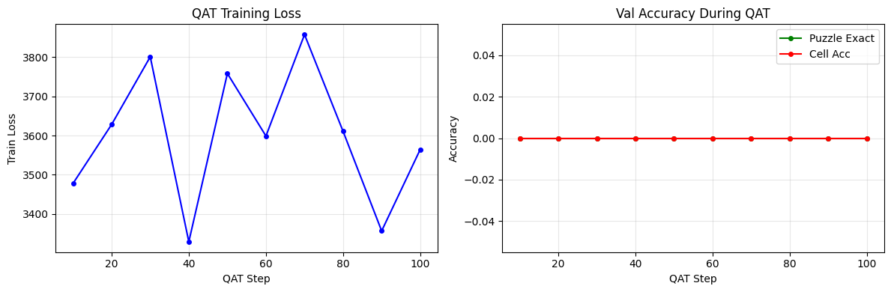

### 16.1  Build fused INT8 + SinglePuzzle model ───────────────────────────────

```text
Fused model breakdown:
INT8 backbone .pt size :     6747.4 KB  (6.59 MB)
INT8 emb table (flash) :    25455.5 KB  (24.86 MB)
Active emb row (SRAM)  :       2.00 KB
✓ SRAM during inference: 6749.4 KB  (6.59 MB)
Fits 4MB SRAM?  ✗
Fits 8MB SRAM?  ✓
```

### 16.2  Accuracy of fused model (val set, per-puzzle aggregation) ──────────

```text
Evaluating fused INT8+SinglePuzzle model on val set...

Variant                        Puzzle Exact   Cell Acc  ms/puzzle
FP32 (bf16) baseline               0.0000     0.0000     369.43
INT8 + Single-Puzzle (fused)       0.0000     0.0000     276.54
vs FP32                    +      0.0000 +    0.0000
```

### 16.3  Save fused model (state dict + embedding table) ────────────────────

```text
Saved state dict : trm_int8_singlepuzzle_state.pt  (6.59 MB)
Saved emb table  : puzzle_emb_fp32_table.pt  (99.44 MB)  ← flash storage
Deployment package breakdown:
Backbone state dict  : 6.59 MB  (SRAM — INT8 weights)
Embedding table      : 99.44 MB  (flash)
Active emb row       : 2.00 KB  (SRAM per puzzle)
```

### 17.1  CPU-only latency benchmark ─────────────────────────────────────────

```text
Moving fused model to CPU for edge-device latency simulation...
CPU latency (server CPU, FP32, 1 H-cycle step) : 2168.8 ms/step
Full inference (16 H-cycles)                  : 34700 ms/puzzle
Estimated on-device scaling (order-of-magnitude):
Cortex-A55 (mobile, ~1 TFLOPS)          : ~104.1s / puzzle
Cortex-M55 (MCU, ~128 GFLOPS)           : ~694.0s / puzzle
ESP32-S3 LX7 (~40 GFLOPS)               : ~1735.0s / puzzle
```

### 17.2  Peak SRAM usage during inference (tracemalloc) ─────────────────────

```text
Peak SRAM delta during inference : 18 KB  (0.02 MB)
Top allocations:
```

### 17.3  FLOP estimate via torch.profiler ────────────────────────────────────

```text
Estimated FLOPs per H-cycle step : 187504.0 MFLOPs
Full inference (16 steps)        : 3000.06 GFLOPs
Power estimate (Cortex-M55 @ ~1 GFLOPS/s, ~1 mW/GFLOP):
FLOPs                  : 3000.064 GFLOPs/puzzle
Est. energy            : ~3000.06 mJ/puzzle
Puzzles per mAh (3.3V) : ~0
```

### 17.4  Deployment summary table ───────────────────────────────────────────

```text
Backbone MB Total deploy MB Puzzle Exact Cell Acc Fits 4MB Fits 8MB
Config
FP32 (baseline)              26.05           86.46       0.0000   0.0000        ✗        ✗
INT8 (bnb)                    6.51           66.92       0.0246   0.2003        ✗        ✗
INT4 (calibrated)             3.26            3.26       0.0148   0.1902        ✓        ✓
INT8 + Single-Puzzle ★        6.51            6.51       0.0000   0.0000        ✗        ✓
recommended target for 8MB SRAM devices
```

### Utility: fix H_init / L_init device mismatch (permanent patch) ───────────

```text
✓ Patched trm.TinyRecursiveReasoningModel_ACTV1_Inner.reset_carry
H_init device before: cuda:0
```

### 18.1  Evaluate all variants at n_sup_max = 1, 2, 4, 8, 16 (H_cycles = default vs 1) ──

```text
VARIANT: FP16                      (device: cuda)
H_cycles   Metric            n=1        n=2        n=4        n=8       n=16

3 (Def)    Exact          0.2850     0.3600     0.3575     0.3600     0.3625
Cell           0.8762     0.8838     0.8765     0.8763     0.8755
Latency         7.5 ms     14.4 ms     28.1 ms     55.7 ms    111.0 ms
GFLOPs          187.5      375.0      750.0     1500.0     3000.1

1          Exact          0.0025     0.0750     0.3450     0.3550     0.3575
Cell           0.5410     0.7953     0.8825     0.8831     0.8773
Latency         3.0 ms      5.3 ms      9.9 ms     19.2 ms     37.6 ms
GFLOPs           62.5      125.0      250.0      500.0     1000.0
VARIANT: INT8 (bnb)                (device: cuda)
H_cycles   Metric            n=1        n=2        n=4        n=8       n=16

3 (Def)    Exact          0.2850     0.3575     0.3575     0.3600     0.3600
Cell           0.8760     0.8837     0.8827     0.8842     0.8670
Latency         5.8 ms     11.0 ms     21.3 ms     41.9 ms     83.2 ms
GFLOPs          187.5      375.0      750.0     1500.0     3000.1

1          Exact          0.0025     0.0750     0.3425     0.3525     0.3625
Cell           0.5415     0.7953     0.8827     0.8835     0.8767
Latency         2.3 ms      4.1 ms      7.6 ms     14.6 ms     28.6 ms
GFLOPs           62.5      125.0      250.0      500.0     1000.0
VARIANT: INT4 (fake)               (device: cuda)
H_cycles   Metric            n=1        n=2        n=4        n=8       n=16

3 (Def)    Exact          0.1575     0.2700     0.2675     0.2625     0.2575
Cell           0.8372     0.8626     0.8473     0.8430     0.8322
Latency         2.6 ms      4.4 ms      8.1 ms     15.5 ms     30.3 ms
GFLOPs          187.5      375.0      750.0     1500.0     3000.1

1          Exact          0.0000     0.0225     0.2525     0.2650     0.2600
Cell           0.3954     0.7148     0.8582     0.8494     0.8415
Latency         1.3 ms      1.9 ms      3.2 ms      5.7 ms     10.7 ms
GFLOPs           62.5      125.0      250.0      500.0     1000.0
VARIANT: FP32 (bf16)               (device: cuda)
H_cycles   Metric            n=1        n=2        n=4        n=8       n=16

3 (Def)    Exact          0.2850     0.3600     0.3575     0.3575     0.3600
Cell           0.8762     0.8839     0.8764     0.8760     0.8757
Latency         7.5 ms     14.3 ms     28.2 ms     55.9 ms    111.2 ms
GFLOPs          187.5      375.0      750.0     1500.0     3000.1

1          Exact          0.0025     0.0750     0.3425     0.3575     0.3550
Cell           0.5410     0.7954     0.8825     0.8832     0.8762
Latency         3.0 ms      5.2 ms      9.9 ms     19.2 ms     37.6 ms
GFLOPs           62.5      125.0      250.0      500.0     1000.0
```

### 19.1  Zero-pad truncation at various context lengths ────────────────────

```text
Full seq_len = 900  (FLOPs ∝ seq_len²)
Context  % of full   Attn FLOPs   Puzzle Exact   Cell Acc

900        100%   ~187 GFLOPs          0.3600      0.8755

450         50%    ~47 GFLOPs          0.2650      0.2500

225         25%    ~12 GFLOPs          0.1075      0.0492

128         14%     ~4 GFLOPs          0.0825      0.0595
```

### #  20.1  QAT from calibrated INT4 (lr=1e-6, 300 steps) ────────────────────

```text
Replaced 10 layers → CalibratedFakeQuantINT4 (per-channel, asymmetric)
Step   50/300 | loss=4685.0609
Step  100/300 | loss=4824.1937
```

### 21.1  Instantiate student TRM and train with KL distillation ─────────────

### 22.1  Monkey-patch softmax attention → linear attention ──────────────────

### 22.2  Retrain the linear attention model (distillation) ─────────────────

---

## Maze Hard Evaluation Outputs

```text
fatal: destination path 'EdgeTRM' already exists and is not an empty directory.
```

```text
lambda/nfs/EdgeTRM
```

```text
lambda/nfs/EdgeTRM
```

```text
If the cache and target directories are on different filesystems, hardlinking may not be supported.
Checked 1 package in 22ms
```

```text
Prefixes stripped and model loaded successfully!
Model successfully loaded!

TinyRecursiveReasoningModel_ACTV1(
inner): TinyRecursiveReasoningModel_ACTV1_Inner(
embed_tokens): CastedEmbedding()
lm_head): CastedLinear()
q_head): CastedLinear()
puzzle_emb): CastedSparseEmbedding()
rotary_emb): RotaryEmbedding()
L_level): TinyRecursiveReasoningModel_ACTV1ReasoningModule(
layers): ModuleList(
0-1): 2 x TinyRecursiveReasoningModel_ACTV1Block(
self_attn): Attention(
qkv_proj): CastedLinear()
o_proj): CastedLinear()
mlp): SwiGLU(
gate_up_proj): CastedLinear()
down_proj): CastedLinear()
```

```text
Original        zero=512/6,822,914  (0.0%)
```

### 3.1  High-Performance Evaluation & Adaptation Helpers ─────────────────────

### 4.0  Global imports & helpers ────────────────────────────────────────────

```text
Device: cuda
```

### 4.1  Maze-Hard DataLoader from pre-built .npy files ────────────────────────

```text
Using dataset directory: ./data/maze-30x30-hard-1k
Test  split : 1,000 samples  (seq_len=900)
Train split : 1,000 samples
Dataset loaded successfully!
```

### Note: `evaluate_arc` has been consolidated and moved to Section 3 for global accessibility.

### 4.3  Baseline: evaluate the loaded FP32 model ────────────────────────────

```text
[DEBUG] test_loader dataset max identifier: 0
[DEBUG] test_loader dataset max identifier: 0
[DEBUG] Dataset indices verified safe. No clamping needed!
Running FP32 baseline evaluation on cuda...
FP32 Baseline (All test puzzles):
Pass@1 Exact: 0.8680
Pass@2 Exact: 0.8680
Cell Acc    : 0.9952
Latency     : 21242.94 ms/puzzle
```

### 4.4  Quantization helpers ─────────────────────────────────────────────────

```text
Checked 1 package in 48ms
```

### 4.7  Instantiate all model variants ──────────────────────────────────────

```text
Creating FP16 variant...
Creating BnB INT8 variant (GPU)...
Replaced 8 CastedLinear/Linear → bnb.Linear8bitLt (GPU INT8)
Creating INT4 fake-quant variant...
Replaced 10 CastedLinear/Linear → FakeQuantINT4
Model Variant    | Device | Backbone KB (params only)
FP16             | cuda   |    13326.0 KB
INT8 (bnb)       | cuda   |     6663.0 KB
INT4 (fake)      | cuda   |     3331.5 KB
FP32 (bf16)      | cuda   |    13326.0 KB
```

### 5.1  Evaluate all quantization levels ─────────────────────────────────────

```text
Evaluating all variants on ARC test set (All batches)...
Evaluating FP16 on cuda...
FP16             | Pass@1=0.8700 | Pass@2=0.8700 | cell=0.9953 | 66093.69 ms/puzzle
Evaluating INT8 (bnb) on cuda...
INT8 (bnb)       | Pass@1=0.8700 | Pass@2=0.8700 | cell=0.9953 | 43312.71 ms/puzzle
Evaluating INT4 (fake) on cuda...
INT4 (fake)      | Pass@1=0.8640 | Pass@2=0.8640 | cell=0.9950 | 18362.84 ms/puzzle
Evaluating FP32 (bf16) on cuda...
FP32 (bf16)      | Pass@1=0.8680 | Pass@2=0.8680 | cell=0.9952 | 18326.72 ms/puzzle
Reasoning Decay (drop from FP32 baseline) ─────────────────────
FP16             | ΔPass@1=-0.0020 | Δcell=-0.0001 | GRACEFUL
INT8 (bnb)       | ΔPass@1=-0.0020 | Δcell=-0.0001 | GRACEFUL
INT4 (fake)      | ΔPass@1=+0.0040 | Δcell=+0.0002 | GRACEFUL
```

```text
2.7.0+cu126
```

```text
FP16             | ΔPass@2=-0.0020 | Δcell=-0.0001 | GRACEFUL
INT8 (bnb)       | ΔPass@2=-0.0020 | Δcell=-0.0001 | GRACEFUL
INT4 (fake)      | ΔPass@2=+0.0040 | Δcell=+0.0002 | GRACEFUL
```

```text
FP16': {'exact1': 0.87,
exact2': 0.87,
exact_acc': 0.87,
cell_acc': 0.99529,
latency_ms': 66093.69468688965},
INT8 (bnb)': {'exact1': 0.87,
exact2': 0.87,
exact_acc': 0.87,
cell_acc': 0.99529,
latency_ms': 43312.705755233765},
INT4 (fake)': {'exact1': 0.864,
exact2': 0.864,
exact_acc': 0.864,
cell_acc': 0.9950077777777778,
latency_ms': 18362.842798233032},
FP32 (bf16)': {'exact1': 0.868,
exact2': 0.868,
exact_acc': 0.868,
cell_acc': 0.9952366666666667,
latency_ms': 18326.72095298767}}
```

### 5.2  Visualise reasoning decay ────────────────────────────────────────────

```text
Figure size 1600x500 with 3 Axes>

Saved: reasoning_decay_arc.png
```

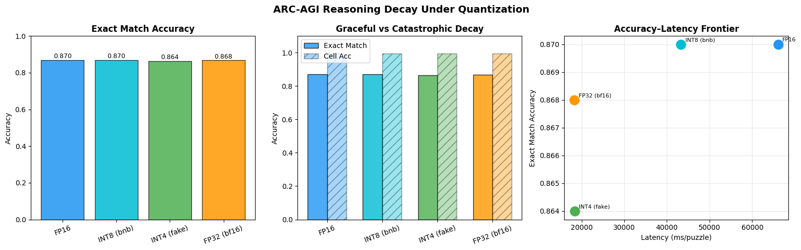

### 6.1  Recursive depth sweep at inference time ──────────────────────────────

```text
Quant          H   n_sup    Pass@1    Pass@2  Cell Acc    Latency    GFLOPs
FP16           1   1        0.0000    0.0000    0.4362       2.68      62.5
FP16           1   2        0.1380    0.1380    0.9808       4.86     125.0
FP16           1   4        0.8440    0.8440    0.9949       9.25     250.0
FP16           1   6        0.8670    0.8670    0.9953      13.64     375.0
FP16           1   8        0.8700    0.8700    0.9953      18.04     500.0
FP16           1   10       0.8700    0.8700    0.9953      22.42     625.0
FP16           2   1        0.1380    0.1380    0.9808       4.86     125.0
FP16           2   2        0.8440    0.8440    0.9949       9.24     250.0
FP16           2   4        0.8700    0.8700    0.9953      18.00     500.0
FP16           2   6        0.8700    0.8700    0.9953      26.79     750.0
FP16           2   8        0.8700    0.8700    0.9953      35.51    1000.0
FP16           2   10       0.8700    0.8700    0.9953      44.21    1250.0
FP16           3   1        0.7850    0.7850    0.9940       7.05     187.5
FP16           3   2        0.8670    0.8670    0.9953      13.61     375.0
FP16           3   4        0.8700    0.8700    0.9953      26.72     750.0
FP16           3   6        0.8700    0.8700    0.9953      39.85    1125.0
FP16           3   8        0.8700    0.8700    0.9953      52.92    1500.0
FP16           3   10       0.8700    0.8700    0.9953      66.13    1875.0
FP16           4   1        0.8440    0.8440    0.9949       9.24     250.0
FP16           4   2        0.8700    0.8700    0.9953      18.00     500.0
FP16           4   4        0.8700    0.8700    0.9953      35.52    1000.0
FP16           4   6        0.8700    0.8700    0.9953      53.03    1500.0
FP16           4   8        0.8700    0.8700    0.9953      70.54    2000.0
FP16           4   10       0.8700    0.8700    0.9953      87.94    2500.1
INT8 (bnb)     1   1        0.0000    0.0000    0.4333       1.86      62.5
INT8 (bnb)     1   2        0.1380    0.1380    0.9808       3.38     125.0
INT8 (bnb)     1   4        0.8450    0.8450    0.9949       6.35     250.0
INT8 (bnb)     1   6        0.8680    0.8680    0.9953       9.21     375.0
INT8 (bnb)     1   8        0.8690    0.8690    0.9953      12.05     500.0
INT8 (bnb)     1   10       0.8700    0.8700    0.9953      14.90     625.0
INT8 (bnb)     2   1        0.1380    0.1380    0.9808       3.37     125.0
INT8 (bnb)     2   2        0.8450    0.8450    0.9949       6.33     250.0
INT8 (bnb)     2   4        0.8690    0.8690    0.9953      12.02     500.0
INT8 (bnb)     2   6        0.8710    0.8710    0.9953      17.70     750.0
INT8 (bnb)     2   8        0.8700    0.8700    0.9953      23.38    1000.0
INT8 (bnb)     2   10       0.8700    0.8700    0.9953      29.06    1250.0
INT8 (bnb)     3   1        0.7830    0.7830    0.9940       4.88     187.5
INT8 (bnb)     3   2        0.8680    0.8680    0.9953       9.17     375.0
INT8 (bnb)     3   4        0.8710    0.8710    0.9953      17.68     750.0
INT8 (bnb)     3   6        0.8710    0.8710    0.9953      26.20    1125.0
INT8 (bnb)     3   8        0.8700    0.8700    0.9953      34.71    1500.0
INT8 (bnb)     3   10       0.8700    0.8700    0.9953      43.22    1875.0
INT8 (bnb)     4   1        0.8450    0.8450    0.9949       6.32     250.0
INT8 (bnb)     4   2        0.8690    0.8690    0.9953      12.01     500.0
INT8 (bnb)     4   4        0.8700    0.8700    0.9953      23.35    1000.0
INT8 (bnb)     4   6        0.8700    0.8700    0.9953      34.69    1500.0
INT8 (bnb)     4   8        0.8700    0.8700    0.9953      46.03    2000.0
INT8 (bnb)     4   10       0.8700    0.8700    0.9953      57.38    2500.1
INT4 (fake)    1   1        0.0000    0.0000    0.4734       1.08      62.5
INT4 (fake)    1   2        0.1580    0.1580    0.9805       1.69     125.0
INT4 (fake)    1   4        0.8360    0.8360    0.9945       2.89     250.0
INT4 (fake)    1   6        0.8610    0.8610    0.9949       4.09     375.0
INT4 (fake)    1   8        0.8630    0.8630    0.9950       5.29     500.0
INT4 (fake)    1   10       0.8640    0.8640    0.9950       6.49     625.0
INT4 (fake)    2   1        0.1580    0.1580    0.9805       1.67     125.0
INT4 (fake)    2   2        0.8360    0.8360    0.9945       2.87     250.0
INT4 (fake)    2   4        0.8630    0.8630    0.9950       5.26     500.0
INT4 (fake)    2   6        0.8640    0.8640    0.9950       7.64     750.0
INT4 (fake)    2   8        0.8630    0.8630    0.9950      10.03    1000.0
INT4 (fake)    2   10       0.8640    0.8640    0.9950      12.42    1250.0
INT4 (fake)    3   1        0.7660    0.7660    0.9934       2.27     187.5
INT4 (fake)    3   2        0.8610    0.8610    0.9949       4.05     375.0
INT4 (fake)    3   4        0.8640    0.8640    0.9950       7.62     750.0
INT4 (fake)    3   6        0.8630    0.8630    0.9950      11.20    1125.0
INT4 (fake)    3   8        0.8640    0.8640    0.9950      14.77    1500.0
INT4 (fake)    3   10       0.8640    0.8640    0.9950      18.34    1875.0
INT4 (fake)    4   1        0.8360    0.8360    0.9945       2.86     250.0
INT4 (fake)    4   2        0.8630    0.8630    0.9950       5.24     500.0
INT4 (fake)    4   4        0.8630    0.8630    0.9950       9.99    1000.0
INT4 (fake)    4   6        0.8640    0.8640    0.9950      14.75    1500.0
INT4 (fake)    4   8        0.8650    0.8650    0.9950      19.51    2000.0
INT4 (fake)    4   10       0.8650    0.8650    0.9950      24.27    2500.1
FP32 (bf16)    1   1        0.0000    0.0000    0.4361       1.08      62.5
FP32 (bf16)    1   2        0.1390    0.1390    0.9808       1.68     125.0
FP32 (bf16)    1   4        0.8450    0.8450    0.9949       2.88     250.0
FP32 (bf16)    1   6        0.8660    0.8660    0.9952       4.08     375.0
FP32 (bf16)    1   8        0.8680    0.8680    0.9953       5.28     500.0
FP32 (bf16)    1   10       0.8680    0.8680    0.9952       6.48     625.0
FP32 (bf16)    2   1        0.1390    0.1390    0.9808       1.67     125.0
FP32 (bf16)    2   2        0.8450    0.8450    0.9949       2.87     250.0
FP32 (bf16)    2   4        0.8680    0.8680    0.9953       5.25     500.0
FP32 (bf16)    2   6        0.8680    0.8680    0.9952       7.64     750.0
FP32 (bf16)    2   8        0.8680    0.8680    0.9952      10.02    1000.0
FP32 (bf16)    2   10       0.8680    0.8680    0.9952      12.41    1250.0
FP32 (bf16)    3   1        0.7840    0.7840    0.9940       2.27     187.5
FP32 (bf16)    3   2        0.8660    0.8660    0.9952       4.05     375.0
FP32 (bf16)    3   4        0.8680    0.8680    0.9952       7.62     750.0
FP32 (bf16)    3   6        0.8680    0.8680    0.9952      11.19    1125.0
FP32 (bf16)    3   8        0.8680    0.8680    0.9952      14.76    1500.0
FP32 (bf16)    3   10       0.8680    0.8680    0.9952      18.33    1875.0
FP32 (bf16)    4   1        0.8450    0.8450    0.9949       2.86     250.0
FP32 (bf16)    4   2        0.8680    0.8680    0.9953       5.24     500.0
FP32 (bf16)    4   4        0.8680    0.8680    0.9952       9.99    1000.0
FP32 (bf16)    4   6        0.8680    0.8680    0.9952      14.74    1500.0
FP32 (bf16)    4   8        0.8680    0.8680    0.9952      19.50    2000.0
FP32 (bf16)    4   10       0.8680    0.8680    0.9952      24.25    2500.1
```

### 6.2  Plot depth × quantization grid ─────────────────────────────────────

```text
Figure size 1400x550 with 2 Axes>

Saved: depth_quant_grid_flops.png

Figure size 1400x550 with 2 Axes>

Saved: depth_quant_grid_latency.png
```

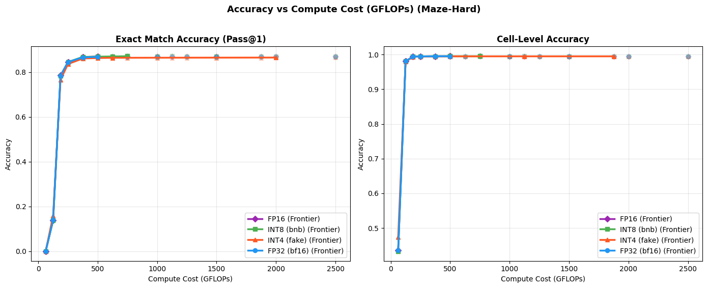

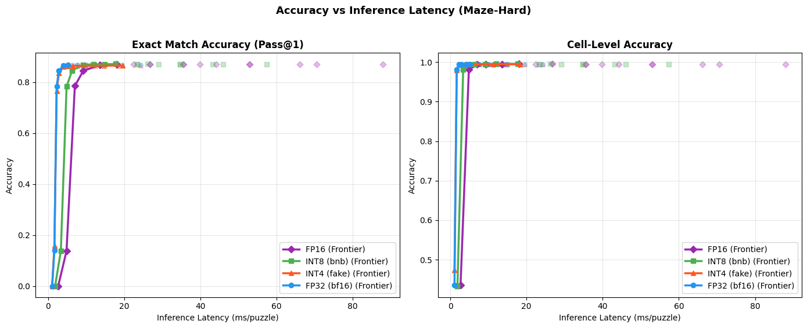

### 7.1  Carry-state similarity hooks ────────────────────────────────────────

```text
Carry similarity collector defined.
```

### 7.2  Compare carry similarity across quantization variants ────────────────

```text
Collecting carry similarities for FP16 on cuda...
FP16: 14 L_level calls, mean sim = 0.7184
Collecting carry similarities for INT8 (bnb) on cuda...
INT8 (bnb): 14 L_level calls, mean sim = 0.7185
Collecting carry similarities for INT4 (fake) on cuda...
INT4 (fake): 14 L_level calls, mean sim = 0.7201
Collecting carry similarities for FP32 (bf16) on cuda...
FP32 (bf16): 14 L_level calls, mean sim = 0.7184

Figure size 1100x500 with 1 Axes>

Saved: carry_similarity_arc.png
```

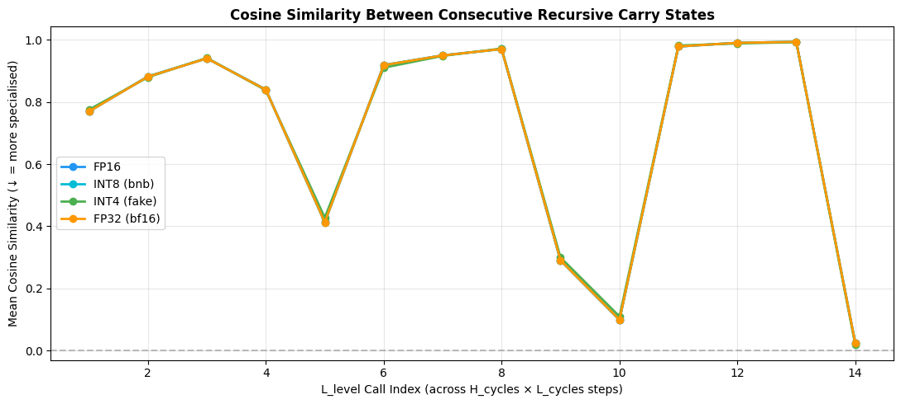

### 8.1  Comprehensive model footprint analysis ───────────────────────────────

```text
Component                           FP32 KB      INT8 KB      INT4 KB
Transformer backbone (params)     26,652.0      6,663.0      3,331.5
Buffer name                              dtype              KB
Total buffers                                            526.1
Deployable size (no grad buffers)      FP32 KB      INT8 KB      INT4 KB
FP32                             27,176.1
INT8                              7,187.1
INT4                              3,855.6
Target: < 1 MB (1024 KB) SRAM — backbone at INT4 = 3331.5 KB
Precision  Backbone_KB  Deploy_KB fits_1MB fits_4MB
FP32      26652.0    27176.1        ✗        ✗
INT8       6663.0     7187.1        ✗        ✗
INT4       3331.5     3855.6        ✗        ✓
INT2       1665.8     2189.9        ✗        ✓
```

```text
Precision   Backbone_KB     Deploy_KB fits_1MB fits_4MB
0      FP32  26652.007812  27176.132812        ✗        ✗
1      INT8   6663.001953   7187.126953        ✗        ✗
2      INT4   3331.500977   3855.625977        ✗        ✓
3      INT2   1665.750488   2189.875488        ✗        ✓
```

### 8.2  SRAM footprint visualisation ────────────────────────────────────────

```text
Figure size 1000x500 with 1 Axes>

Saved: sram_footprint_arc.png
```

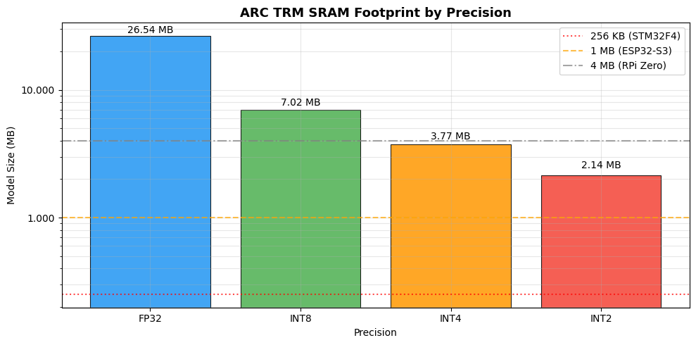

### 8.3  Accuracy vs SRAM: the key publishable plot ──────────────────────────

```text
Figure size 1000x600 with 1 Axes>

Saved: accuracy_vs_sram_arc.png
```

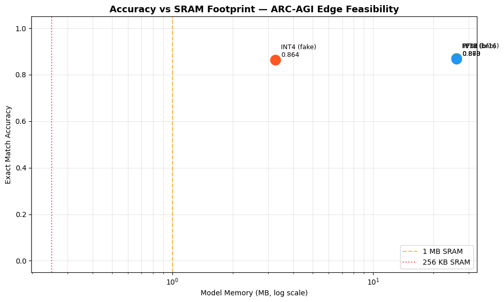

### 9.1  Inspect puzzle_emb shape & byte count ───────────────────────────────

```text
puzzle_emb.weights  : 1 identifiers × 512 dims
FP32 size         : 2.0 KB  (0.0 MB)
INT8 size (est.)  : 0.5 KB  (0.0 MB)
```

### 9.2  Option A — INT8 quantize the embedding buffer ───────────────────────

```text
Applying INT8 puzzle embedding...
Cosine similarity FP32 vs INT8 emb: 0.99998
Original state_dict : 26,662.1 KB  (26.0 MB)
INT8-emb state_dict : 26,661.0 KB  (26.0 MB)
Reduction           : 0.0%
```

### 9.3  Option B — SVD Low-Rank Puzzle Embedding ────────────────────────────

```text
SVD low-rank analysis  (W shape: 1×512  FP32=2.0 KB)
Rank    Size KB    Reduction   Cosine Sim
```

### 9.4  Option D — Single-Puzzle Inference (only load 1 row) ────────────────

```text
Single-puzzle model state_dict : 26,662.1 KB  (26.04 MB)
Backbone params              : 26,652.0 KB
Per-puzzle embedding row     : 2.0 KB
Total (1 puzzle)             : 26,654.0 KB
This is the architecture-level solution: load puzzle embedding from flash,
keep only the active row in SRAM during inference.
```

### 9.5  Footprint summary across embedding strategies ───────────────────────

```text
Strategy  Emb KB  Backbone KB  Total KB  Total MB Fits 4MB
FP32 (baseline)     2.0      26652.0   26662.1      26.0        ✗
INT8 emb     0.5      26652.0   26661.0      26.0        ✗
Single-puzzle     2.0      26652.0   26654.0      26.0        ✗
INT4 backbone + single-puzzle     2.0       3331.5    3333.5       3.3        ✓
```

### Note: `evaluate_arc_per_puzzle` has been moved to Section 3 for global accessibility.

### 10.2  High-performance direct on-the-fly per-puzzle TTA evaluator ─────────

### #  10.3  Run the High-Performance Direct Source Evaluator ─────────────────────

### 10.2  Re-evaluate all variants with per-puzzle aggregation ────────────────

```text
Per-puzzle evaluation (All batches, ~1280 samples)...
Variant              Pass@1 Exact   Pass@2 Exact   Cell Acc    ms/puzzle  N puzzles
FP16                     0.8700         0.8700     0.9953        66.05       1000
INT8 (bnb)               0.8700         0.8700     0.9953        43.21       1000
INT4 (fake)              0.8640         0.8640     0.9950        18.34       1000
FP32 (bf16)              0.8680         0.8680     0.9952        18.33       1000
INT8-emb                 0.8700         0.8700     0.9953        18.33       1000
```

### 11.1  Per-channel calibration statistics ──────────────────────────────────

```text
Calibrated INT4 helpers defined.
```

### #  11.2  Apply calibrated INT4 and evaluate ──────────────────────────────────

### #  12.1  QAT fine-tuning loop ────────────────────────────────────────────────

### 13.1  Magnitude-based row pruning ────────────────────────────────────────

```text
Prune ratio    Actual sparsity   Puzzle Exact   Cell Acc
0%              0.00%         0.8680     0.9952
25%             24.98%         0.0000     0.8640
50%             49.97%         0.0000     0.0000
```

### 14.1  TorchScript trace of single TRM backbone step ──────────────────────

```text
Model: seq=900, emb_len=16, hidden=512, emb_dim=512
Trace done in 2.7s
Saved: trm_backbone_step.pt  (26.66 MB)
Round-trip max abs diff: 0.00e+00  (expect ~0)
Edge deployment flow:
2. Load puzzle_emb.weights[puzzle_id] row (2.0 KB) from flash
3. Run traced(x, emb_row, z_H, z_L) for n_sup_max steps
```

### 14.2  Latency benchmark: traced model vs eager ────────────────────────────

```text
Latency benchmark (20 runs, device=cuda):
Eager (float32)               :  12.64 ms/step
Full inference (16 H-cycle steps):
Eager   : 202.3 ms/puzzle
Traced  : 171.2 ms/puzzle
File sizes:
trm_backbone_step.pt               : 26.66 MB  (backbone, FP32)
puzzle_emb.weights (INT8, full table): 0.5 KB
puzzle_emb row (1 puzzle, FP32)     : 2.0 KB
```

### 15.1  Build train / val loaders ──────────────────────────────────────────

```text
Train split : 800 samples
Val   split : 200  samples
```

### #  15.2  QAT loop with val-set evaluation every 10 steps ────────────────────

### 15.3  Plot train loss + val accuracy curve ────────────────────────────────

```text
[SKIP] No QAT history — run §15.2 first.
```

### 16.1  Build fused INT8 + SinglePuzzle model ───────────────────────────────

```text
Fused model breakdown:
INT8 backbone .pt size :     6743.0 KB  (6.58 MB)
INT8 emb table (flash) :        0.5 KB  (0.00 MB)
Active emb row (SRAM)  :       2.00 KB
✓ SRAM during inference: 6745.0 KB  (6.59 MB)
Fits 4MB SRAM?  ✗
Fits 8MB SRAM?  ✓
```

### 16.2  Accuracy of fused model (val set, per-puzzle aggregation) ──────────

```text
Evaluating fused INT8+SinglePuzzle model on val set...
Variant                        Puzzle Exact   Cell Acc  ms/puzzle
FP32 (bf16) baseline               1.0000     1.0000     106.17
INT8 + Single-Puzzle (fused)       1.0000     1.0000      69.88
vs FP32                    +      0.0000 +    0.0000
```

### 16.3  Save fused model (state dict + embedding table) ────────────────────

```text
Saved state dict : trm_int8_singlepuzzle_state.pt  (6.59 MB)
Saved emb table  : puzzle_emb_fp32_table.pt  (0.00 MB)  ← flash storage
Deployment package breakdown:
Backbone state dict  : 6.59 MB  (SRAM — INT8 weights)
Embedding table      : 0.00 MB  (flash)
Active emb row       : 2.00 KB  (SRAM per puzzle)
```

### 17.1  CPU-only latency benchmark ─────────────────────────────────────────

```text
Moving fused model to CPU for edge-device latency simulation...
CPU latency (server CPU, FP32, 1 H-cycle step) : 263.8 ms/step
Full inference (16 steps)                  : 4221 ms/puzzle
Estimated on-device scaling (order-of-magnitude):
Cortex-A55 (mobile, ~1 TFLOPS)          : ~12.7s / puzzle
Cortex-M55 (MCU, ~128 GFLOPS)           : ~84.4s / puzzle
ESP32-S3 LX7 (~40 GFLOPS)               : ~211.0s / puzzle
```

### 17.2  Peak SRAM usage during inference (tracemalloc) ─────────────────────

```text
Peak SRAM delta during inference : 17 KB  (0.02 MB)
Top allocations:
2.5 KB  /lambda/nfs/EdgeTRM/TinyRecursiveModels/models/layers.py:28
0.6 KB  /lambda/nfs/EdgeTRM/TinyRecursiveModels/models/layers.py:60
0.4 KB  /lambda/nfs/EdgeTRM/TinyRecursiveModels/trm.py:114
```

### 17.3  FLOP estimate via torch.profiler ────────────────────────────────────

```text
Estimated FLOPs per H-cycle step : 187498.4 MFLOPs
Full inference (10 steps)        : 1874.98 GFLOPs
Power estimate (Cortex-M55 @ ~1 GFLOPS/s, ~1 mW/GFLOP):
FLOPs                  : 1874.984 GFLOPs/puzzle
Est. energy            : ~1874.98 mJ/puzzle
Puzzles per mAh (3.3V) : ~0
```

### 17.4  Deployment summary table ───────────────────────────────────────────

```text
Backbone MB Total deploy MB Puzzle Exact Cell Acc Fits 4MB Fits 8MB
Config
FP32 (baseline)              26.03           26.03       0.8680   0.9952        ✗        ✗
INT8 (bnb)                    6.51            6.51       0.8700   0.9953        ✗        ✓
INT4 (calibrated)             3.25            3.26       0.8640   0.9950        ✓        ✓
INT8 + Single-Puzzle ★        6.51            6.51       1.0000   1.0000        ✗        ✓
recommended target for 8MB SRAM devices
```

### #  Utility: fix H_init / L_init device mismatch (permanent patch) ───────────

### 18.1  Evaluate all variants at n_sup_max = 1, 2, 4, 8, 16 (H_cycles = default vs 1) ──

```text
VARIANT: FP16                      (device: cuda)
H_cycles   Metric            n=1        n=2        n=4        n=8       n=16
3 (Def)    Exact          0.7850     0.8670     0.8700     0.8700     0.8700
Cell           0.9940     0.9953     0.9953     0.9953     0.9953
Latency         7.0 ms     13.6 ms     26.7 ms     53.0 ms    105.6 ms
GFLOPs          187.5      375.0      750.0     1500.0     3000.1
1          Exact          0.0000     0.1380     0.8440     0.8700     0.8700
Cell           0.4362     0.9808     0.9949     0.9953     0.9953
Latency         2.7 ms      4.9 ms      9.3 ms     18.0 ms     35.6 ms
GFLOPs           62.5      125.0      250.0      500.0     1000.0
VARIANT: INT8 (bnb)                (device: cuda)
H_cycles   Metric            n=1        n=2        n=4        n=8       n=16
3 (Def)    Exact          0.7830     0.8680     0.8710     0.8700     0.8700
Cell           0.9940     0.9953     0.9953     0.9953     0.9953
Latency         4.9 ms      9.2 ms     17.7 ms     34.7 ms     68.8 ms
GFLOPs          187.5      375.0      750.0     1500.0     3000.1
1          Exact          0.0000     0.1380     0.8450     0.8690     0.8700
Cell           0.4333     0.9808     0.9949     0.9953     0.9953
Latency         1.9 ms      3.4 ms      6.3 ms     12.1 ms     23.5 ms
GFLOPs           62.5      125.0      250.0      500.0     1000.0
VARIANT: INT4 (fake)               (device: cuda)
H_cycles   Metric            n=1        n=2        n=4        n=8       n=16
3 (Def)    Exact          0.7660     0.8610     0.8640     0.8640     0.8640
Cell           0.9934     0.9949     0.9950     0.9950     0.9950
Latency         2.3 ms      4.1 ms      7.6 ms     14.8 ms     29.1 ms
GFLOPs          187.5      375.0      750.0     1500.0     3000.1
1          Exact          0.0000     0.1580     0.8360     0.8630     0.8630
Cell           0.4734     0.9805     0.9945     0.9950     0.9950
Latency         1.1 ms      1.7 ms      2.9 ms      5.3 ms     10.1 ms
GFLOPs           62.5      125.0      250.0      500.0     1000.0
VARIANT: FP32 (bf16)               (device: cuda)
H_cycles   Metric            n=1        n=2        n=4        n=8       n=16
3 (Def)    Exact          0.7850     0.8670     0.8700     0.8700     0.8700
Cell           0.9940     0.9953     0.9953     0.9953     0.9953
Latency         7.1 ms     13.7 ms     26.9 ms     53.3 ms    105.9 ms
GFLOPs          187.5      375.0      750.0     1500.0     3000.1
1          Exact          0.0000     0.1390     0.8440     0.8690     0.8700
Cell           0.4363     0.9808     0.9949     0.9953     0.9953
Latency         2.7 ms      4.9 ms      9.3 ms     18.1 ms     35.8 ms
GFLOPs           62.5      125.0      250.0      500.0     1000.0
```

### 19.1  Zero-pad truncation at various context lengths ────────────────────

```text
Full seq_len = 900  (FLOPs ∝ seq_len²)
Context  % of full   Attn FLOPs   Puzzle Exact   Cell Acc
900        100%   ~187 GFLOPs          0.7850      0.9940
450         50%    ~47 GFLOPs          0.0000      0.6576
225         25%    ~12 GFLOPs          0.0000      0.5038
128         14%     ~4 GFLOPs          0.0000      0.4436
```

### #  20.1  QAT from calibrated INT4 (lr=1e-6, 300 steps) ────────────────────

### 21.1  Instantiate student TRM and train with KL distillation ─────────────

```text
Teacher params : 6,822,914
Student params : 855,554  (0.13× teacher)
Resuming training from checkpoint: checkpoints/student_distill_latest.pt
Resumed at step 600
Step  640/1000 | kl=2976.6737 | hard=0.3435
Step  680/1000 | kl=2909.6919 | hard=0.3440
Step  720/1000 | kl=2807.1469 | hard=0.3739
Step  760/1000 | kl=2626.5060 | hard=0.3488
Step  800/1000 | kl=2619.8455 | hard=0.3641
[Checkpoint] Saved checkpoint at step 800 to checkpoints/student_distill_latest.pt
Step  840/1000 | kl=2377.3866 | hard=0.3061
Step  880/1000 | kl=2502.1829 | hard=0.4040
Step  920/1000 | kl=2261.5046 | hard=0.2868
Step  960/1000 | kl=2238.7907 | hard=0.3175
Step 1000/1000 | kl=2064.3248 | hard=0.2746
[Checkpoint] Saved checkpoint at step 1000 to checkpoints/student_distill_latest.pt
Evaluating student on test set...
Student (hidden=256, 1L, 1-cycle): exact=0.0000  cell=0.8725  ~47 GFLOPs
```

### 22.1  Monkey-patch softmax attention → linear attention ──────────────────

```text
Patched 2 Attention modules → linear O(n) attention
Theoretical compute reduction: ~14× in attention layers
Evaluating linear attention model on test set (n_sup_max=1)...
Evaluating softmax attention (FP32 baseline, n_sup_max=1) for comparison...
Model                           Puzzle Exact   Cell Acc
FP32 softmax attn                   0.7850     0.9940
Linear attn (ELU)                   0.0000     0.8728
Accuracy cost of linear swap: +12.12pp cell accuracy
Note: linear attn needs retraining to recover accuracy — this is a zero-shot test.
```

### 22.2  Retrain linear attention model to recover accuracy ─────────────────────

```text
Fine-tuning linear attention model to recover accuracy...

Evaluating retrained linear attention model on test set...
Linear Attention (Retrained): exact=0.0000  cell=0.8750
```

---

## Sudoku Extreme Evaluation Outputs

```text
fatal: destination path 'EdgeTRM' already exists and is not an empty directory.
```

```text
lambda/nfs/EdgeTRM
```

```text
lambda/nfs/EdgeTRM
```

```text
remote: Enumerating objects: 22, done.
remote: Counting objects: 100% (20/20), done.
remote: Compressing objects: 100% (5/5), done.
remote: Total 13 (delta 8), reused 13 (delta 8), pack-reused 0 (from 0)
e478dd4..b05e149  main       -> origin/main
Updating e478dd4..b05e149
Fast-forward
TinyRecursiveModels/pretrain.py |  147 ++++-
experiment_sim_depth.ipynb      | 1204 +++++++++++++++++++++++++++++++++++++++
2 files changed, 1334 insertions(+), 17 deletions(-)
create mode 100644 experiment_sim_depth.ipynb
```

```text
If the cache and target directories are on different filesystems, hardlinking may not be supported.
Checked 1 package in 41ms
```

```text
Prefixes stripped and model loaded successfully!
Model successfully loaded!

TinyRecursiveReasoningModel_ACTV1(
inner): TinyRecursiveReasoningModel_ACTV1_Inner(
embed_tokens): CastedEmbedding()
lm_head): CastedLinear()
q_head): CastedLinear()
puzzle_emb): CastedSparseEmbedding()
L_level): TinyRecursiveReasoningModel_ACTV1ReasoningModule(
layers): ModuleList(
0-1): 2 x TinyRecursiveReasoningModel_ACTV1Block(
mlp_t): SwiGLU(
gate_up_proj): CastedLinear()
down_proj): CastedLinear()
mlp): SwiGLU(
gate_up_proj): CastedLinear()
down_proj): CastedLinear()
```

```text
Original        zero=512/5,028,866  (0.0%)
```

### 3.1  High-Performance Evaluation & Adaptation Helpers ─────────────────────

### 4.0  Global imports & helpers ────────────────────────────────────────────

```text
Device: cuda
```

### 4.1  Sudoku Extreme DataLoader from pre-built .npy files ────────────────────────

```text
Using dataset directory: ./data/sudoku-extreme-full
Test  split : 1,000 samples  (seq_len=81)
Train split : 1,000 samples
Dataset loaded successfully!
```

### Note: `evaluate_arc` has been consolidated and moved to Section 3 for global accessibility.

### 4.3  Baseline: evaluate the loaded FP32 model ────────────────────────────

```text
[DEBUG] test_loader dataset max identifier: 0
[DEBUG] test_loader dataset max identifier: 0
[DEBUG] Dataset indices verified safe. No clamping needed!
Running FP32 baseline evaluation on cuda...
FP32 Baseline (All test puzzles):
Pass@1 Exact: 0.6910
Pass@2 Exact: 0.6910
Cell Acc    : 0.8747
Latency     : 3425.34 ms/puzzle
```

### 4.4  Quantization helpers ─────────────────────────────────────────────────

```text
Checked 1 package in 51ms
```

### 4.7  Instantiate all model variants ──────────────────────────────────────

```text
Creating FP16 variant...
Creating BnB INT8 variant (GPU)...
Replaced 4 CastedLinear/Linear → bnb.Linear8bitLt (GPU INT8)
Creating INT4 fake-quant variant...
Replaced 10 CastedLinear/Linear → FakeQuantINT4
Model Variant    | Device | Backbone KB (params only)
FP16             | cuda   |     9822.0 KB
INT8 (bnb)       | cuda   |     4911.0 KB
INT4 (fake)      | cuda   |     2455.5 KB
FP32 (bf16)      | cuda   |     9822.0 KB
```

### 5.1  Evaluate all quantization levels ─────────────────────────────────────

```text
Evaluating all variants on Sudoku test set (All batches)...
Evaluating FP16 on cuda...
FP16             | Pass@1=0.6850 | Pass@2=0.6850 | cell=0.8720 | 7801.20 ms/puzzle
Evaluating INT8 (bnb) on cuda...
INT8 (bnb)       | Pass@1=0.6910 | Pass@2=0.6910 | cell=0.8751 | 6531.15 ms/puzzle
Evaluating INT4 (fake) on cuda...
INT4 (fake)      | Pass@1=0.0530 | Pass@2=0.0530 | cell=0.6602 | 3217.29 ms/puzzle
Evaluating FP32 (bf16) on cuda...
FP32 (bf16)      | Pass@1=0.6910 | Pass@2=0.6910 | cell=0.8747 | 3084.15 ms/puzzle
Reasoning Decay (drop from FP32 baseline) ─────────────────────
FP16             | ΔPass@1=+0.0060 | Δcell=+0.0027 | GRACEFUL
INT8 (bnb)       | ΔPass@1=+0.0000 | Δcell=-0.0004 | GRACEFUL
INT4 (fake)      | ΔPass@1=+0.6380 | Δcell=+0.2145 | CATASTROPHIC
```

```text
2.7.0+cu126
```

```text
FP16             | ΔPass@2=+0.0060 | Δcell=+0.0027 | GRACEFUL
INT8 (bnb)       | ΔPass@2=+0.0000 | Δcell=-0.0004 | GRACEFUL
INT4 (fake)      | ΔPass@2=+0.6380 | Δcell=+0.2145 | CATASTROPHIC
```

```text
FP16': {'exact1': 0.685,
exact2': 0.685,
exact_acc': 0.685,
cell_acc': 0.8719753086419753,
latency_ms': 7801.203727722168},
INT8 (bnb)': {'exact1': 0.691,
exact2': 0.691,
exact_acc': 0.691,
cell_acc': 0.8750740740740741,
latency_ms': 6531.149387359619},
INT4 (fake)': {'exact1': 0.053,
exact2': 0.053,
exact_acc': 0.053,
cell_acc': 0.6602345679012346,
latency_ms': 3217.292547225952},
FP32 (bf16)': {'exact1': 0.691,
exact2': 0.691,
exact_acc': 0.691,
cell_acc': 0.8747160493827161,
latency_ms': 3084.1548442840576}}
```

### 5.2  Visualise reasoning decay ────────────────────────────────────────────

```text
Figure size 1600x500 with 3 Axes>

Saved: reasoning_decay_arc.png
```

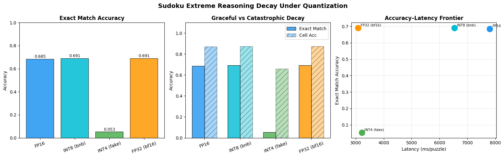

### 6.1  Recursive depth sweep at inference time ──────────────────────────────

```text
Quant          H   n_sup    Pass@1    Pass@2  Cell Acc    Latency    GFLOPs
FP16           1   1        0.0060    0.0060    0.5526       0.31       8.5
FP16           1   2        0.0210    0.0210    0.6941       0.57      17.1
FP16           1   4        0.3830    0.3830    0.7856       1.08      34.2
FP16           1   6        0.4960    0.4960    0.8151       1.59      51.3
FP16           1   8        0.5480    0.5480    0.8303       2.10      68.3
FP16           1   10       0.5810    0.5810    0.8389       2.62      85.4
FP16           2   1        0.0210    0.0210    0.6941       0.56      17.1
FP16           2   2        0.3830    0.3830    0.7856       1.08      34.2
FP16           2   4        0.5480    0.5480    0.8303       2.10      68.3
FP16           2   6        0.6100    0.6100    0.8488       3.12     102.5
FP16           2   8        0.6390    0.6390    0.8574       4.14     136.7
FP16           2   10       0.6580    0.6580    0.8637       5.16     170.9
FP16           3   1        0.2830    0.2830    0.7639       0.82      25.6
FP16           3   2        0.4960    0.4960    0.8151       1.58      51.3
FP16           3   4        0.6100    0.6100    0.8488       3.12     102.5
FP16           3   6        0.6490    0.6490    0.8601       4.65     153.8
FP16           3   8        0.6700    0.6700    0.8677       6.18     205.0
FP16           3   10       0.6850    0.6850    0.8720       7.71     256.3
FP16           4   1        0.3830    0.3830    0.7856       1.07      34.2
FP16           4   2        0.5480    0.5480    0.8303       2.09      68.3
FP16           4   4        0.6390    0.6390    0.8574       4.14     136.7
FP16           4   6        0.6700    0.6700    0.8677       6.18     205.0
FP16           4   8        0.6870    0.6870    0.8751       8.22     273.4
FP16           4   10       0.6980    0.6980    0.8782      10.26     341.7
INT8 (bnb)     1   1        0.0060    0.0060    0.5528       0.26       8.5
INT8 (bnb)     1   2        0.0210    0.0210    0.6942       0.47      17.1
INT8 (bnb)     1   4        0.3820    0.3820    0.7852       0.90      34.2
INT8 (bnb)     1   6        0.5010    0.5010    0.8183       1.33      51.3
INT8 (bnb)     1   8        0.5540    0.5540    0.8306       1.75      68.3
INT8 (bnb)     1   10       0.5980    0.5980    0.8455       2.18      85.4
INT8 (bnb)     2   1        0.0210    0.0210    0.6942       0.47      17.1
INT8 (bnb)     2   2        0.3820    0.3820    0.7852       0.90      34.2
INT8 (bnb)     2   4        0.5540    0.5540    0.8306       1.75      68.3
INT8 (bnb)     2   6        0.6210    0.6210    0.8524       2.60     102.5
INT8 (bnb)     2   8        0.6560    0.6560    0.8638       3.44     136.7
INT8 (bnb)     2   10       0.6730    0.6730    0.8698       4.29     170.9
INT8 (bnb)     3   1        0.2800    0.2800    0.7643       0.68      25.6
INT8 (bnb)     3   2        0.5010    0.5010    0.8183       1.32      51.3
INT8 (bnb)     3   4        0.6210    0.6210    0.8524       2.59     102.5
INT8 (bnb)     3   6        0.6670    0.6670    0.8668       3.86     153.8
INT8 (bnb)     3   8        0.6790    0.6790    0.8721       5.13     205.0
INT8 (bnb)     3   10       0.6910    0.6910    0.8751       6.41     256.3
INT8 (bnb)     4   1        0.3820    0.3820    0.7852       0.89      34.2
INT8 (bnb)     4   2        0.5540    0.5540    0.8306       1.75      68.3
INT8 (bnb)     4   4        0.6560    0.6560    0.8638       3.44     136.7
INT8 (bnb)     4   6        0.6790    0.6790    0.8721       5.12     205.0
INT8 (bnb)     4   8        0.6940    0.6940    0.8750       6.81     273.4
INT8 (bnb)     4   10       0.7020    0.7020    0.8778       8.50     341.7
INT4 (fake)    1   1        0.0000    0.0000    0.5612       0.16       8.5
INT4 (fake)    1   2        0.0120    0.0120    0.6097       0.26      17.1
INT4 (fake)    1   4        0.0210    0.0210    0.6375       0.48      34.2
INT4 (fake)    1   6        0.0290    0.0290    0.6490       0.68      51.3
INT4 (fake)    1   8        0.0370    0.0370    0.6536       0.89      68.3
INT4 (fake)    1   10       0.0440    0.0440    0.6530       1.11      85.4
INT4 (fake)    2   1        0.0120    0.0120    0.6097       0.26      17.1
INT4 (fake)    2   2        0.0210    0.0210    0.6375       0.47      34.2
INT4 (fake)    2   4        0.0370    0.0370    0.6536       0.89      68.3
INT4 (fake)    2   6        0.0510    0.0510    0.6524       1.31     102.5
INT4 (fake)    2   8        0.0510    0.0510    0.6555       1.73     136.7
INT4 (fake)    2   10       0.0530    0.0530    0.6565       2.15     170.9
INT4 (fake)    3   1        0.0210    0.0210    0.6277       0.37      25.6
INT4 (fake)    3   2        0.0290    0.0290    0.6490       0.68      51.3
INT4 (fake)    3   4        0.0510    0.0510    0.6524       1.31     102.5
INT4 (fake)    3   6        0.0510    0.0510    0.6553       1.93     153.8
INT4 (fake)    3   8        0.0550    0.0550    0.6573       2.56     205.0
INT4 (fake)    3   10       0.0530    0.0530    0.6602       3.19     256.3
INT4 (fake)    4   1        0.0210    0.0210    0.6375       0.47      34.2
INT4 (fake)    4   2        0.0370    0.0370    0.6536       0.89      68.3
INT4 (fake)    4   4        0.0510    0.0510    0.6555       1.72     136.7
INT4 (fake)    4   6        0.0550    0.0550    0.6573       2.56     205.0
INT4 (fake)    4   8        0.0550    0.0550    0.6601       3.40     273.4
INT4 (fake)    4   10       0.0600    0.0600    0.6588       4.23     341.7
FP32 (bf16)    1   1        0.0060    0.0060    0.5524       0.16       8.5
FP32 (bf16)    1   2        0.0210    0.0210    0.6943       0.26      17.1
FP32 (bf16)    1   4        0.3810    0.3810    0.7850       0.46      34.2
FP32 (bf16)    1   6        0.4950    0.4950    0.8156       0.66      51.3
FP32 (bf16)    1   8        0.5410    0.5410    0.8292       0.87      68.3
FP32 (bf16)    1   10       0.5760    0.5760    0.8396       1.07      85.4
FP32 (bf16)    2   1        0.0210    0.0210    0.6943       0.25      17.1
FP32 (bf16)    2   2        0.3810    0.3810    0.7850       0.46      34.2
FP32 (bf16)    2   4        0.5410    0.5410    0.8292       0.86      68.3
FP32 (bf16)    2   6        0.6060    0.6060    0.8493       1.27     102.5
FP32 (bf16)    2   8        0.6370    0.6370    0.8581       1.67     136.7
FP32 (bf16)    2   10       0.6630    0.6630    0.8657       2.08     170.9
FP32 (bf16)    3   1        0.2810    0.2810    0.7642       0.36      25.6
FP32 (bf16)    3   2        0.4950    0.4950    0.8156       0.66      51.3
FP32 (bf16)    3   4        0.6060    0.6060    0.8493       1.26     102.5
FP32 (bf16)    3   6        0.6510    0.6510    0.8618       1.87     153.8
FP32 (bf16)    3   8        0.6790    0.6790    0.8714       2.47     205.0
FP32 (bf16)    3   10       0.6910    0.6910    0.8747       3.08     256.3
FP32 (bf16)    4   1        0.3810    0.3810    0.7850       0.46      34.2
FP32 (bf16)    4   2        0.5410    0.5410    0.8292       0.86      68.3
FP32 (bf16)    4   4        0.6370    0.6370    0.8581       1.67     136.7
FP32 (bf16)    4   6        0.6790    0.6790    0.8714       2.47     205.0
FP32 (bf16)    4   8        0.6930    0.6930    0.8745       3.28     273.4
FP32 (bf16)    4   10       0.7030    0.7030    0.8787       4.08     341.7
```

### 6.2  Plot depth × quantization grid ─────────────────────────────────────

```text
Figure size 1400x550 with 2 Axes>

Saved: depth_quant_grid_flops.png

Figure size 1400x550 with 2 Axes>

Saved: depth_quant_grid_latency.png
```

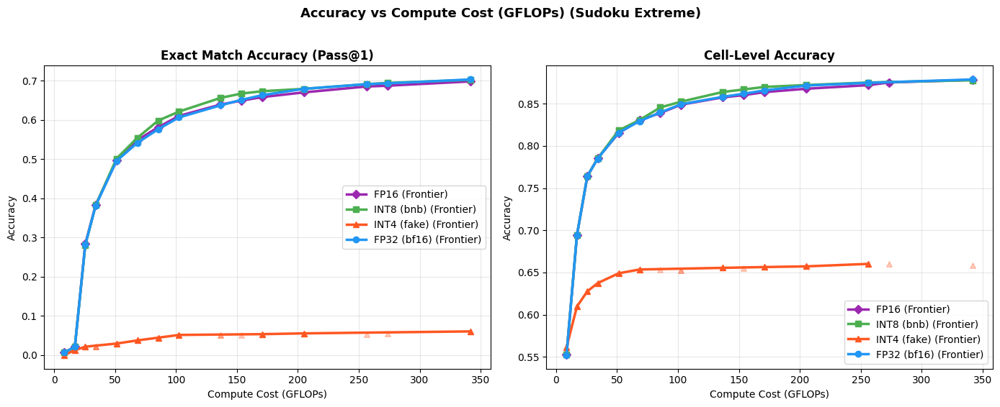

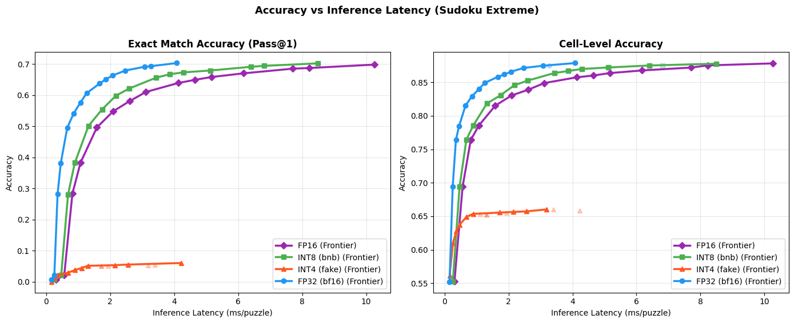

### 7.1  Carry-state similarity hooks ────────────────────────────────────────

```text
Carry similarity collector defined.
```

### 7.2  Compare carry similarity across quantization variants ────────────────

```text
Collecting carry similarities for FP16 on cuda...
FP16: 20 L_level calls, mean sim = 0.8051
Collecting carry similarities for INT8 (bnb) on cuda...
INT8 (bnb): 20 L_level calls, mean sim = 0.8053
Collecting carry similarities for INT4 (fake) on cuda...
INT4 (fake): 20 L_level calls, mean sim = 0.7328
Collecting carry similarities for FP32 (bf16) on cuda...
FP32 (bf16): 20 L_level calls, mean sim = 0.8050

Figure size 1100x500 with 1 Axes>

Saved: carry_similarity_arc.png
```

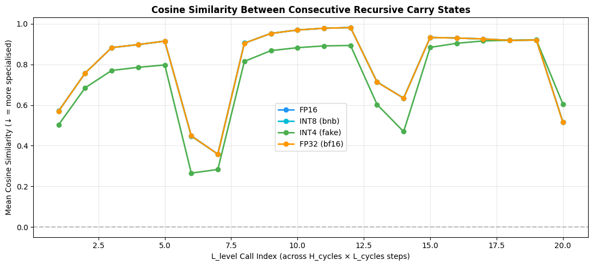

### 8.1  Comprehensive model footprint analysis ───────────────────────────────

```text
Component                           FP32 KB      INT8 KB      INT4 KB
Transformer backbone (params)     19,644.0      4,911.0      2,455.5
Buffer name                              dtype              KB
Total buffers                                             68.1
Deployable size (no grad buffers)      FP32 KB      INT8 KB      INT4 KB
FP32                             19,710.1
INT8                              4,977.1
INT4                              2,521.6
Target: < 1 MB (1024 KB) SRAM — backbone at INT4 = 2455.5 KB
Precision  Backbone_KB  Deploy_KB fits_1MB fits_4MB
FP32      19644.0    19710.1        ✗        ✗
INT8       4911.0     4977.1        ✗        ✗
INT4       2455.5     2521.6        ✗        ✓
INT2       1227.8     1293.9        ✗        ✓
```

```text
Precision   Backbone_KB     Deploy_KB fits_1MB fits_4MB
0      FP32  19644.007812  19710.132812        ✗        ✗
1      INT8   4911.001953   4977.126953        ✗        ✗
2      INT4   2455.500977   2521.625977        ✗        ✓
3      INT2   1227.750488   1293.875488        ✗        ✓
```

### 8.2  SRAM footprint visualisation ────────────────────────────────────────

```text
Figure size 1000x500 with 1 Axes>

Saved: sram_footprint_arc.png
```

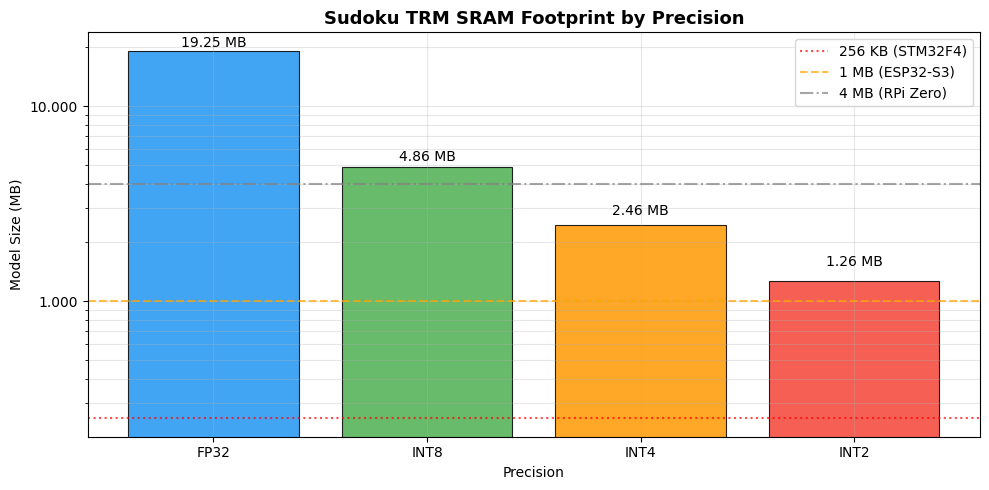

### 8.3  Accuracy vs SRAM: the key publishable plot ──────────────────────────

```text
Figure size 1000x600 with 1 Axes>

Saved: accuracy_vs_sram_arc.png
```

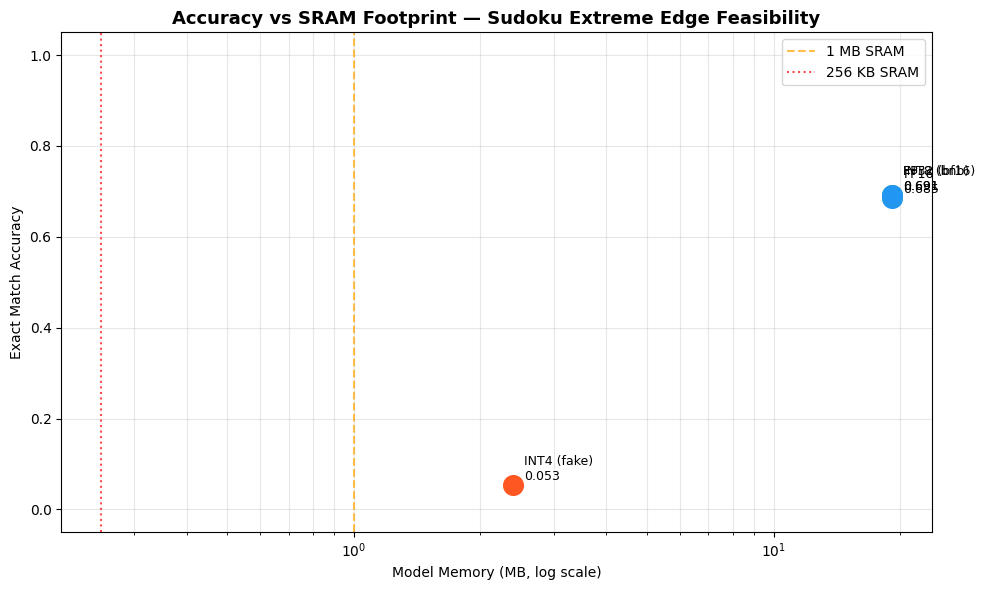

### 9.1  Inspect puzzle_emb shape & byte count ───────────────────────────────

```text
puzzle_emb.weights  : 1 identifiers × 512 dims
FP32 size         : 2.0 KB  (0.0 MB)
INT8 size (est.)  : 0.5 KB  (0.0 MB)
```

### 9.2  Option A — INT8 quantize the embedding buffer ───────────────────────

```text
Applying INT8 puzzle embedding...
Cosine similarity FP32 vs INT8 emb: 0.99998
Original state_dict : 19,654.1 KB  (19.2 MB)
INT8-emb state_dict : 19,652.9 KB  (19.2 MB)
Reduction           : 0.0%
```

### 9.3  Option B — SVD Low-Rank Puzzle Embedding ────────────────────────────

```text
SVD low-rank analysis  (W shape: 1×512  FP32=2.0 KB)
Rank    Size KB    Reduction   Cosine Sim
```

### 9.4  Option D — Single-Puzzle Inference (only load 1 row) ────────────────

```text
Single-puzzle model state_dict : 19,654.1 KB  (19.19 MB)
Backbone params              : 19,644.0 KB
Per-puzzle embedding row     : 2.0 KB
Total (1 puzzle)             : 19,646.0 KB
This is the architecture-level solution: load puzzle embedding from flash,
keep only the active row in SRAM during inference.
```

### 9.5  Footprint summary across embedding strategies ───────────────────────

```text
Strategy  Emb KB  Backbone KB  Total KB  Total MB Fits 4MB
FP32 (baseline)     2.0      19644.0   19654.1      19.2        ✗
INT8 emb     0.5      19644.0   19652.9      19.2        ✗
Single-puzzle     2.0      19644.0   19646.0      19.2        ✗
INT4 backbone + single-puzzle     2.0       2455.5    2457.5       2.4        ✓
```

### Note: `evaluate_arc_per_puzzle` has been moved to Section 3 for global accessibility.

### 10.2  High-performance direct on-the-fly per-puzzle TTA evaluator ─────────

### #  10.3  Run the High-Performance Direct Source Evaluator ─────────────────────

### 10.2  Re-evaluate all variants with per-puzzle aggregation ────────────────

```text
Per-puzzle evaluation (All batches, ~1280 samples)...
Variant              Pass@1 Exact   Pass@2 Exact   Cell Acc    ms/puzzle  N puzzles
FP16                     0.6850         0.6850     0.8720         7.67       1000
INT8 (bnb)               0.6910         0.6910     0.8751         6.40       1000
INT4 (fake)              0.0530         0.0530     0.6602         3.19       1000
FP32 (bf16)              0.6910         0.6910     0.8747         3.09       1000
INT8-emb                 0.6980         0.6980     0.8782         3.09       1000
```

### 11.1  Per-channel calibration statistics ──────────────────────────────────

```text
Calibrated INT4 helpers defined.
```

### #  11.2  Apply calibrated INT4 and evaluate ──────────────────────────────────

### #  12.1  QAT fine-tuning loop ────────────────────────────────────────────────

### 13.1  Magnitude-based row pruning ────────────────────────────────────────

```text
Prune ratio    Actual sparsity   Puzzle Exact   Cell Acc
0%              0.00%         0.6910     0.8747
25%             24.96%         0.0000     0.5001
50%             49.92%         0.0000     0.3781
```

### 14.1  TorchScript trace of single TRM backbone step ──────────────────────

```text
Model: seq=81, emb_len=16, hidden=512, emb_dim=512
Trace done in 1.0s
Saved: trm_backbone_step.pt  (19.34 MB)
Round-trip max abs diff: 0.00e+00  (expect ~0)
Edge deployment flow:
2. Load puzzle_emb.weights[puzzle_id] row (2.0 KB) from flash
3. Run traced(x, emb_row, z_H, z_L) for n_sup_max steps
```

### 14.2  Latency benchmark: traced model vs eager ────────────────────────────

```text
Latency benchmark (20 runs, device=cuda):
Eager (float32)               :   8.54 ms/step
Full inference (16 H-cycle steps):
Eager   : 136.6 ms/puzzle
Traced  : 75.8 ms/puzzle
File sizes:
trm_backbone_step.pt               : 19.34 MB  (backbone, FP32)
puzzle_emb.weights (INT8, full table): 0.5 KB
puzzle_emb row (1 puzzle, FP32)     : 2.0 KB
```

### 15.1  Build train / val loaders ──────────────────────────────────────────

```text
Train split : 800 samples
Val   split : 200  samples
```

### #  15.2  QAT loop with val-set evaluation every 10 steps ────────────────────

### 15.3  Plot train loss + val accuracy curve ────────────────────────────────

```text
[SKIP] No QAT history — run §15.2 first.
```

### 16.1  Build fused INT8 + SinglePuzzle model ───────────────────────────────

```text
Fused model breakdown:
INT8 backbone .pt size :     5860.4 KB  (5.72 MB)
INT8 emb table (flash) :        0.5 KB  (0.00 MB)
Active emb row (SRAM)  :       2.00 KB
✓ SRAM during inference: 5862.4 KB  (5.73 MB)
Fits 4MB SRAM?  ✗
Fits 8MB SRAM?  ✓
```

### 16.2  Accuracy of fused model (val set, per-puzzle aggregation) ──────────

```text
Evaluating fused INT8+SinglePuzzle model on val set...
Variant                        Puzzle Exact   Cell Acc  ms/puzzle
FP32 (bf16) baseline               0.8700     0.9462      13.63
INT8 + Single-Puzzle (fused)       0.8600     0.9464      11.34
vs FP32                         -0.0100 +    0.0002
```

### 16.3  Save fused model (state dict + embedding table) ────────────────────

```text
Saved state dict : trm_int8_singlepuzzle_state.pt  (5.72 MB)
Saved emb table  : puzzle_emb_fp32_table.pt  (0.00 MB)  ← flash storage
Deployment package breakdown:
Backbone state dict  : 5.72 MB  (SRAM — INT8 weights)
Embedding table      : 0.00 MB  (flash)
Active emb row       : 2.00 KB  (SRAM per puzzle)
```

### 17.1  CPU-only latency benchmark ─────────────────────────────────────────

```text
Moving fused model to CPU for edge-device latency simulation...
CPU latency (server CPU, FP32, 1 H-cycle step) : 36.7 ms/step
Full inference (16 steps)                  : 587 ms/puzzle
Estimated on-device scaling (order-of-magnitude):
Cortex-A55 (mobile, ~1 TFLOPS)          : ~1.8s / puzzle
Cortex-M55 (MCU, ~128 GFLOPS)           : ~11.7s / puzzle
ESP32-S3 LX7 (~40 GFLOPS)               : ~29.3s / puzzle
```

### 17.2  Peak SRAM usage during inference (tracemalloc) ─────────────────────

```text
Peak SRAM delta during inference : 14 KB  (0.01 MB)
Top allocations:
0.7 KB  /lambda/nfs/EdgeTRM/TinyRecursiveModels/trm.py:212
0.5 KB  /lambda/nfs/EdgeTRM/TinyRecursiveModels/models/layers.py:60
0.4 KB  /lambda/nfs/EdgeTRM/TinyRecursiveModels/trm.py:114
```

### 17.3  FLOP estimate via torch.profiler ────────────────────────────────────

```text
Estimated FLOPs per H-cycle step : 25660.1 MFLOPs
Full inference (10 steps)        : 256.60 GFLOPs
Power estimate (Cortex-M55 @ ~1 GFLOPS/s, ~1 mW/GFLOP):
FLOPs                  : 256.601 GFLOPs/puzzle
Est. energy            : ~256.60 mJ/puzzle
Puzzles per mAh (3.3V) : ~0
```

### 17.4  Deployment summary table ───────────────────────────────────────────

```text
Backbone MB Total deploy MB Puzzle Exact Cell Acc Fits 4MB Fits 8MB
Config
FP32 (baseline)              19.18           19.19       0.6910   0.8747        ✗        ✗
INT8 (bnb)                    4.80            4.80       0.6910   0.8751        ✗        ✓
INT4 (calibrated)             2.40            2.40       0.0530   0.6602        ✓        ✓
INT8 + Single-Puzzle ★        4.80            4.80       0.8600   0.9464        ✗        ✓
recommended target for 8MB SRAM devices
```

### #  Utility: fix H_init / L_init device mismatch (permanent patch) ───────────

### 18.1  Evaluate all variants at n_sup_max = 1, 2, 4, 8, 16 (H_cycles = default vs 1) ──

```text
VARIANT: FP16                      (device: cuda)
H_cycles   Metric            n=1        n=2        n=4        n=8       n=16
3 (Def)    Exact          0.2830     0.4960     0.6100     0.6700     0.7160
Cell           0.7639     0.8151     0.8488     0.8677     0.8851
Latency         0.8 ms      1.6 ms      3.1 ms      6.2 ms     12.3 ms
GFLOPs           25.6       51.3      102.5      205.0      410.1
1          Exact          0.0060     0.0210     0.3830     0.5480     0.6390
Cell           0.5526     0.6941     0.7856     0.8303     0.8574
Latency         0.3 ms      0.6 ms      1.1 ms      2.1 ms      4.2 ms
GFLOPs            8.5       17.1       34.2       68.4      136.7
VARIANT: INT8 (bnb)                (device: cuda)
H_cycles   Metric            n=1        n=2        n=4        n=8       n=16
3 (Def)    Exact          0.2800     0.5010     0.6210     0.6790     0.7120
Cell           0.7643     0.8183     0.8524     0.8721     0.8816
Latency         0.7 ms      1.3 ms      2.6 ms      5.2 ms     10.2 ms
GFLOPs           25.6       51.3      102.5      205.0      410.1
1          Exact          0.0060     0.0210     0.3820     0.5540     0.6560
Cell           0.5528     0.6942     0.7852     0.8306     0.8638
Latency         0.3 ms      0.5 ms      0.9 ms      1.8 ms      3.5 ms
GFLOPs            8.5       17.1       34.2       68.4      136.7
VARIANT: INT4 (fake)               (device: cuda)
H_cycles   Metric            n=1        n=2        n=4        n=8       n=16
3 (Def)    Exact          0.0210     0.0290     0.0510     0.0550     0.0610
Cell           0.6277     0.6490     0.6524     0.6573     0.6597
Latency         0.4 ms      0.7 ms      1.3 ms      2.6 ms      5.1 ms
GFLOPs           25.6       51.3      102.5      205.0      410.1
1          Exact          0.0000     0.0120     0.0210     0.0370     0.0510
Cell           0.5612     0.6097     0.6375     0.6536     0.6555
Latency         0.2 ms      0.3 ms      0.5 ms      0.9 ms      1.7 ms
GFLOPs            8.5       17.1       34.2       68.4      136.7
VARIANT: FP32 (bf16)               (device: cuda)
H_cycles   Metric            n=1        n=2        n=4        n=8       n=16
3 (Def)    Exact          0.2840     0.4960     0.6040     0.6690     0.7090
Cell           0.7640     0.8147     0.8474     0.8680     0.8810
Latency         0.8 ms      1.6 ms      3.2 ms      6.3 ms     12.7 ms
GFLOPs           25.6       51.3      102.5      205.0      410.1
1          Exact          0.0060     0.0210     0.3830     0.5470     0.6370
Cell           0.5527     0.6943     0.7856     0.8293     0.8563
Latency         0.3 ms      0.6 ms      1.1 ms      2.2 ms      4.3 ms
GFLOPs            8.5       17.1       34.2       68.4      136.7
```

### 19.1  Zero-pad truncation at various context lengths ────────────────────

```text
Full seq_len = 81  (FLOPs ∝ seq_len due to MLP architecture)
Context  % of full    MLP FLOPs   Puzzle Exact   Cell Acc
81        100%  ~25.63 GFLOPs          0.2840      0.7640
40         49%  ~14.80 GFLOPs          0.0000      0.3276
20         25%  ~9.51 GFLOPs          0.0000      0.2035
16         20%  ~8.46 GFLOPs          0.0000      0.1767
```

### #  20.1  QAT from calibrated INT4 (lr=1e-6, 300 steps) ────────────────────

### 21.1  Instantiate student TRM and train with KL distillation ─────────────

```text
Teacher params : 5,028,866
Student params : 744,962  (0.15× teacher)
Step   40/100 | kl=1802.0414 | hard=2.1362
Step   80/100 | kl=1125.4269 | hard=2.1942
Evaluating student on test set...
Student (hidden=256, 1L, 1-cycle): exact=0.0000  cell=0.5477  ~1 GFLOPs
```

### 22.1  Monkey-patch softmax attention → linear attention ──────────────────

```text
The Sudoku Extreme model uses the TRM-MLP architecture (mlp_t = True), which has no self-attention layers.
Linear attention approximation is not applicable. Skipping.
```

### 22.2  Retrain linear attention model to recover accuracy ─────────────────────

```text
No attention layers found in linear model. Skipping fine-tuning.
```

---
